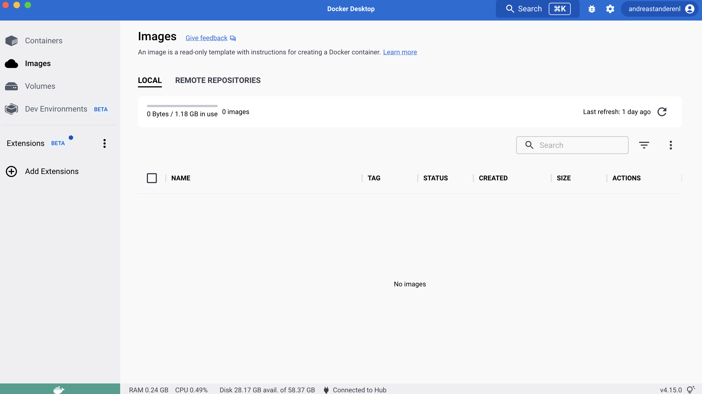
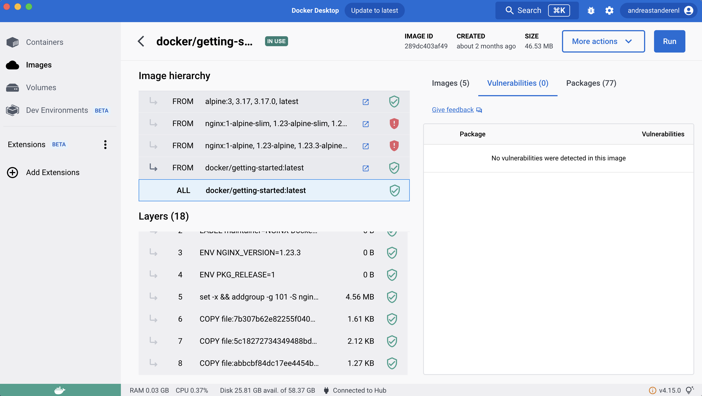
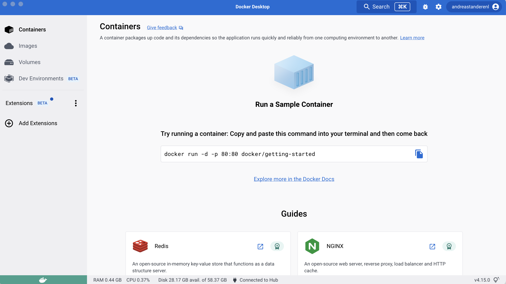
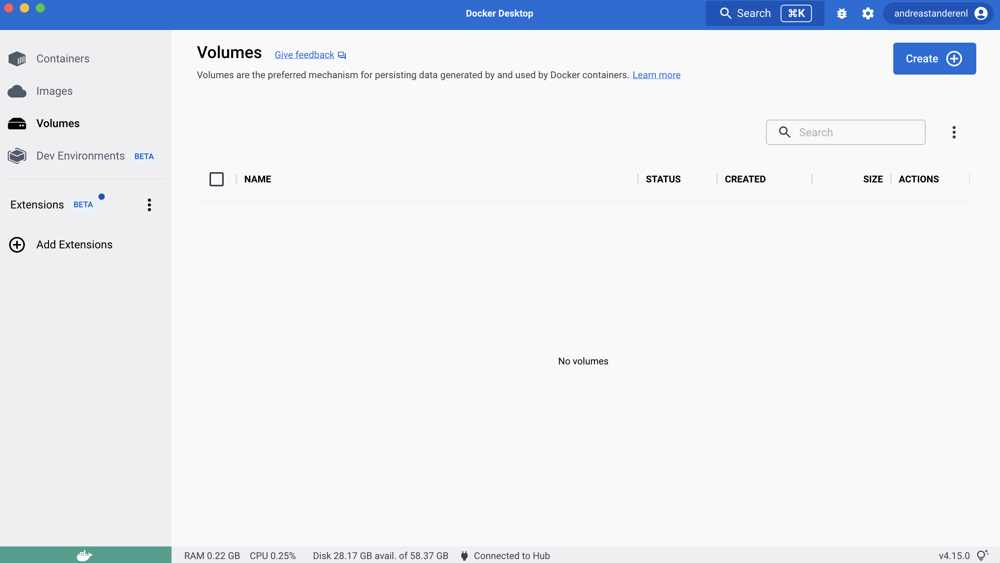
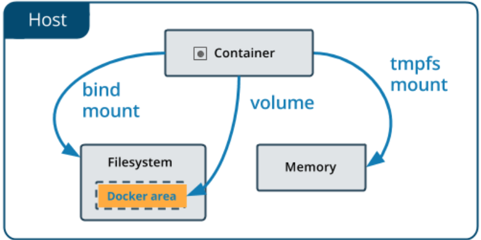

# Docker Desktop

If you do not yet have Docker Desktop downloaded,
go [
here](https://www.docker.com/products/docker-desktop/)
and
download the desktop suited for your hardware.

## What is Docker Desktop?

Docker Desktop is an application that includes all
programs
needed for you to build and share containerized
applications
on your machine. What is a _containerized
application_ you
might ask? An application that is containerized
can be any
application you like that you isolate to run in an
environment where you easily can control what
versions
different dependencies uses and what environment
variables
it should use. The environment can be on your
physical local
machine or a remote machine. Usually you start
running the
containerized application on your physical machine
during
development and when features are ready to be
deployed to
production the containerized application will
reside on a
remote host.

The approach of containerizing an application
starts by
making a **Dockerfile** which will be _built into
an image_.
If then _running the image_ you will get a _
running
container_
which you can access by an address and a port.
Continue
reading for an explanation of how you can interact
with
Docker Desktop to get information of your local
and remote
images and containers.

## Images

As mentioned, images are the resulting unit you
get when
telling Docker to build an image based on the
content of a
Dockerfile. In most cases a Dockerfile includes
one or
more `COPY` commands which moves your local files
into the
Docker image along with some commands that should
be
executed when the image is used to start a
container.
Packing this information together inside an image
allows for
easily sharing and running applications between
physical
computers.



In Docker Desktop you can manage your images by
locating to
the images tab. Clicking an image will show how
the image
was built up based on other images, and how
commands in the
Dockerfiles from these images result into
different _layers_
.

<details>
<summary>Want to know more about layers?</summary>

### Layers

In order to understand exactly what a _layer_ is,
lets first
make it clear that images are based on other
images. And all
images are based on different commands which will
be
explained in more
detail [later in the course](./02-dockerfile).
Each time
Docker executes a command a new layer is made
which is
actually the _difference_ between the image before
and after
the command was executed.
</details>



## Containers

Also as mentioned, containers are the unit you get
when
telling Docker to run an image. The commands
stated in the
Dockerfile has made the foundation of how this
container
will behave, such as:

- What command will be executed inside the
  container when
  you run the image.
- What commands will be executed while making the
  container.
- What will be the working directory that the
  commands are
  executed from.
- What environment variables it uses.
  to mention some characteristics.



In Docker Desktop you can see the containers that
either run
or has been stopped on your machine.
Clicking into a container will show it's logs,
environment
variables, resource usage, configuration and even
a terminal
tab.

## Volumes

Since containers are easily terminated because of
their light weight, they are not suitable for
storing persistent data. When the container dies
all the data it has gathered or generated, as well
as all state-related data, will be lost forever.
That is, however, if you do not have a _volume_. A
volume is simply a directory on the host machine
of the running container that the container will
use to mount its data up and down to. The only
thing the container needs to know is the name of
the volume and the path to where in the containers
file system it will mount the data to. Docker will
then take care of making the actual reference from
the containers mount path to the data persisted
some where else on the host machine.



In Docker Desktop you can see all volumes on your
local machine by locating to the volumes tab on
the left-side menu. When clicking on a volume you
can see what containers that er using that volume
and to what path the container is mounting the
data on the volume.

<details>
<summary>What are bind mounts in comparison?</summary>

### Bind Mounts

Bind mounts are a simpler way of persisting data
on a container, but instead of letting Docker take
care of the mounting and referencing, you are
explicitly providing the container with a
reference path to the host machine.

</details>

## Resources

Click the cog icon in the top right and then _
Resources_ to
manage the CPU and memory allocated to Docker
Desktop.]()

## 🫵🏽 Try yourself

Create a running container by copying the command
on the frontpage of
Docker Desktop
when opening the Containers tab. Open your
terminal and
enter the command.

```bash
docker run -d -p 80:80 docker/getting-started
```

### Task 1.1

Figure out how much memory the container uses.
<details>
<summary>✅ Answer 1.1</summary>

Click on the running container in Docker Desktop
and see the `Stats` tab and see that the container
uses 5,4 MB memory.
</details>

### Task 1.2

Figure out what environment variables that are
defined for the container.
<details>
<summary>✅ Answer 1.2</summary>

Click on the running container in Docker Desktop
and see the `Inspect` tab and see that the
container has the following 4 environment
variables defined:

1. `PATH`: /usr/local/sbin:/usr/local/bin:
   /usr/sbin:/usr/bin:/sbin:/bin
2. `NGINX_VERSION`: 1.23.3
3. `PKG_RELEASE`: 1
4. `NJS_VERSION`: 0.7.9

</details>

### Task 1.3

Figure out how many images
the `docker/getting-started` image is based on.
<details>
<summary>✅ Answer 1.3</summary>

Click on the image named `docker/getting-started`
in Docker Desktop
and see that there are 4 `FROM` instructions in
total building up the final image that now resides
on your machine.
</details>

### Task 1.4

Create a volume with this command:

```bash
docker volume create workshop-volume
```

And create a new container that is using that
volume:

```bash
docker run -d -p 5000:5000 --name workshop-container -v workshop-volume:/data nginx
```

Figure out where on your local machine the data
used by the container is stored, i.e., what is the
path to the volume mount?
<details>
<summary>✅ Answer 1.4</summary>

Inspect the
container and see the path under _Mounts_.

```bash
/var/lib/docker/volumes/workshop-volume/_data
```

</details>

### Task 1.5 - For those who wants an extra challenge 😈

Open the _data_ tab under _volumes_ in Docker
Desktop and see that there is no data.

Let's try add some!

Open the terminal of the running container:

```bash
docker exec -it workshop-container bash
```

Locate to the folder where the data from the
volume is mounted to and add a file. You see a
change in the _data_ tab in Docker Desktop?

<details>
<summary> 💡 Need a tip?</summary>

If you wonder where the data is stored in the
container take a closer look on the command that
started the container:

```bash
docker run -d -p 5000:5000 --name workshop-container -v workshop-volume:/data nginx
```

Especially this
part; `-v <volume_name>:<path_in_container_to_mount_data>`
, will tell you where to find the data on the
container.
</details>

<details>
<summary>✅ Answer 1.5</summary>

After running the `docker exec` command all you
need is the following two lines:

```bash
cd data
touch test-file.html
```

Locating to the _data_ tab under _volumes_ in
Docker Desktop after doing this will reveal the
newly added file.

</details>